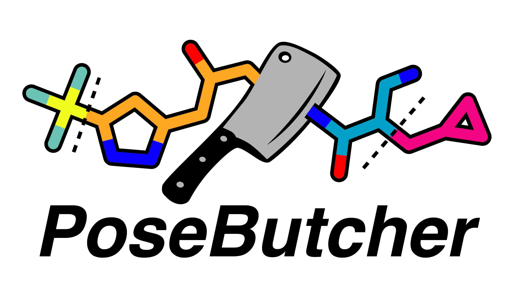

# PoseButcher



> "A good butcher always trims the fat"

PoseButcher is a tool for categorising and segmenting virtual hits with reference to experimental protein structures and (fragment) hits.

Ligand atoms are tagged with categories:

	- GOOD:

		* fragment space: within the fragment bolus
		* pocket X: in a specified catalytic/allosteric pocket X

	- BAD:
		
		* protein clash: Clashing with the protein
		* solvent space: Heading out of the protein/crystal

## Usage at a glance

	1. Create the butcher (see PoseButcher.__init__):

		from posebutcher import PoseButcher
		butcher = PoseButcher(protein, hits, pockets)

	2. Chop up a posed virtual hit (rdkit.ROMol with a conformer):

		result = butcher.chop(mol)

	3. Tag a compound based on its pocket occupancy and clashes:

		tags = butcher.tag(mol)

	4. Explore the expansion opportunities from a given atom in a virtual hit

		result = butcher.explore(mol)

	5. (Coming soon) Trim a parts of a compound that clash with a protein or leave the crystal

		mol = butcher.trim(mol)

	6. (Coming soon) Score how well a virtual hit recapitulates shape and colour of the fragment bolus

		score: float = butcher.score(mol)

## Sample output

### Protein, ligand, and catalytic site pockets with Open3D:


### A chopped up ligand:


### Exploring expansion vector into a desirable pocket


## Installation

1. Install PoseButcher:

`pip install --upgrade posebutcher`

*N.B. open3d version 0.18 or greater is required*

### Common installation issues

**PyGAMer build fails on Linux HPC**

PoseButcher uses PyGAMer to calculate the surface meshes from PDB files (used for the protein and fragment bolus). The current workaround is to install PoseButcher without PyGAMer and then import an existing PoseButcher using `PoseButcher.from_directory` or PoseButcher.protein_mesh = '/path/to/protein_mesh.ply'.

```
pip install --upgrade MolParse open3d jupyterlab pandas
pip install --upgrade --no-dependencies posebutcher
```

If initialised without the `from_directory` method, add a protein mesh to an existing PoseButcher using:

```
butcher.protein_mesh = '/path/to/protein_mesh.ply'
butcher._clip_pockets()
```

## Examples

PoseButcher ships with some open access test data from the XChem group at Diamond Light Source, funded by the ASAP consortium.

To run the "example.ipynb":

```
git clone git@github.com:mwinokan/PoseButcher
cd PoseButcher
jupyter lab
```
