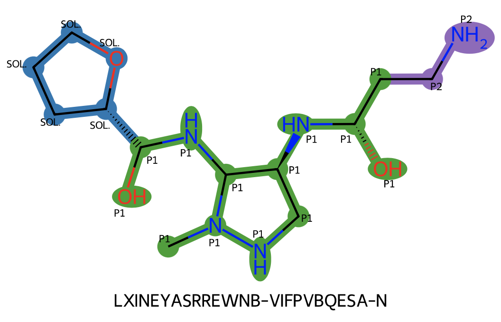

.. PoseButcher documentation master file, created by
   sphinx-quickstart on Wed Mar 20 14:31:51 2024.
   You can adapt this file completely to your liking, but it should at least
   contain the root `toctree` directive.

=========================
PoseButcher Documentation
=========================

Installation
============

PoseButcher has several dependencies, which can't all be managed via a pip installation. Notable vtkbool, open3d and PyGAMer can cause problems. In a fresh conda python=3.10 virtual environment execute the folowing:

::

   conda install -y -c conda-forge vtkbool
   pip install --upgrade posebutcher

Open3d is required in all cases. PyGaMER is only necessary to generate protein surfaces, which can be computed on a different machine, or omitted from calculations. vtkbool is required for pocket-protein clipping. In case you want to use posebutcher without one of the optional dependencies:

::

   pip install --upgrade posebutcher --no-dependencies

Getting started
===============

This example uses the open science 2a viral protease fragment screen from the ASAP consortium, available on `Fragalysis
<https://fragalysis.diamond.ac.uk>`. The test data used in this example is available at test_data_.

Creating a :class:`.PoseButcher` object
---------------------------------------

Specify a reference protein structure:

::
   
   protein = 'test_data/2a_Ax0310a_apo-desolv.pdb'
   
In order to butcher ligands with reference to the space occupied by fragments, specify a set of hits in an SD file:

::
   
   hits = 'test_data/2a_fragments.sdf'

Defining the pockets can be tricky, It is suggested you use an external tool (PyMOL/Fragalysis) to pick the correct atoms. Currently only spherical pockets are supported. {ockets should be a `dict` with `str` keys and `dict` values. Below, spherical pockets are defined at the centre of mass of several atoms with a radius defined by the average distance from CoM to the atoms or a given value:

::
   
   pockets = {
       "P1": dict(type='sphere', atoms=['GLY 127 O', 'PRO 107 CG', 'CYS 110 SG'], radius='mean'),
       "P2": dict(type='sphere', atoms=['VAL 84 CG1', 'TYR 90 CD2', 'SER 87 CB'], radius='mean'),
       "P1'": dict(type='sphere', atoms=['GLU 88 CB', 'PRO 107 CB', 'HIS 21 CD2'], radius='mean'),
       "P2'": dict(type='sphere', atoms=['PRO 107 CB', 'LEU 22 CD1'], shift=[0, 0, 0], radius='mean'),
       "P3": dict(type='sphere', atoms=['GLY 127 O', 'GLU 85 CB'], radius=4),
       "P4": dict(type='sphere', atoms=['LEU 98 CD2'], radius=5),
       "P5": dict(type='sphere', atoms=['ASN 129 ND2', 'ASN 129 ND2', 'ILE 82 CG2'], radius=4),
       "P6": dict(type='sphere', atoms=['ILE 82 CG2'], shift=[-1,0,1], radius=4),
   }

A chain letter can also be specified e.g. (`'GLY 127 O A'`). The `radius` parameter can be a float, 'mean', 'min', or 'max'. The `shift` keyword applies a translation to the center of the spherical pocket. 

The :class:`.PoseButcher` object can then be created:

::

   butcher = PoseButcher(
               protein, 
               hits, 
               pockets, 
               pocket_clip=True, 
               pocket_clip_protein=True, 
               pocket_clip_hull=True,
              )

Pocket clipping can take a while, when iterating on the pocket definitions you may prefer to disable it. `pocket_clip == False` will disable all clipping, alternatively just disable clipping to the protein with `pocket_clip_protein` (or it's hull with `pocket_clip_hull`). Pass a list of chain characters as `pocket_chains` to duplicate the pockets across the specified chains.

To view the 3d meshes created use :meth:`PoseButcher.render`:

::

   butcher.render()

Using :meth:`PoseButcher.chop`
------------------------------

Use :meth:`PoseButcher.chop` to `chop` up a posed de novo compound. First, let's load a test molecule:

::

   mol_df = PandasTools.LoadSDF('test_data/2a_bases.sdf')
   mol = mol_df.iloc[1]['ROMol']
   mol._Name = mol_df.iloc[1]['ID']

:meth:`PoseButcher.chop` can tell you whether the atoms in a ligand are in user-defined pockets, overlapping with the fragment bolus, clashing with the protein, or in the solvent space:

::

   result = butcher.chop(mol, draw='2d')

A 3d view is also available:

::

   result = butcher.chop(mol, draw='3d')

In both cases, the result is a dictionary with atom index keys:

::

   {
       0: ('GOOD', 'pocket', 'P1'),
       1: ('GOOD', 'pocket', 'P1'),
       2: ('GOOD', 'pocket', 'P1'),
       3: ('GOOD', 'pocket', 'P1'),
       4: ('GOOD', 'pocket', 'P1'),
       5: ('GOOD', 'pocket', 'P1'),
       6: ('GOOD', 'pocket', 'P1'),
       7: ('GOOD', 'pocket', 'P1'),
       8: ('GOOD', 'pocket', 'P2'),
       9: ('GOOD', 'pocket', 'P2'),
      10: ('GOOD', 'pocket', 'P2'),
      11: ('GOOD', 'pocket', 'P1'),
      12: ('GOOD', 'pocket', 'P1'),
      13: ('GOOD', 'pocket', 'P1'),
      14: ('GOOD', 'pocket', 'P1'),
      15: ('BAD', 'solvent space'),
      16: ('BAD', 'solvent space'),
      17: ('BAD', 'solvent space'),
      18: ('BAD', 'solvent space'),
      19: ('BAD', 'solvent space')
   }

The :meth:`PoseButcher.tag` method will return a set of the atom classifications.

File I/O of a :class:`.PoseButcher` object
------------------------------------------

If you are happy with your :class:`.PoseButcher` object you can export it using :meth:`PoseButcher.write`.

A new instance can be created using the :meth:`PoseButcher.from_directory` classmethod.

Changing the protein of a :class:`.PoseButcher` object
------------------------------------------------------

To change the reference protein simply:

::

   butcher.protein = '/new/path/to/protein.pdb'

See also the example notebook_ on github.

.. _notebook: https://github.com/mwinokan/PoseButcher/blob/main/example.ipynb
.. _test_data: https://github.com/mwinokan/PoseButcher/blob/main/test_data

.. toctree::
   :maxdepth: 2
   :caption: Contents:

   vector
