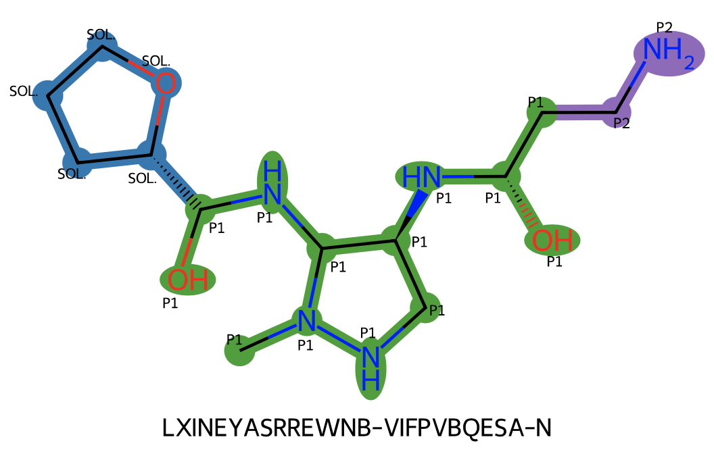
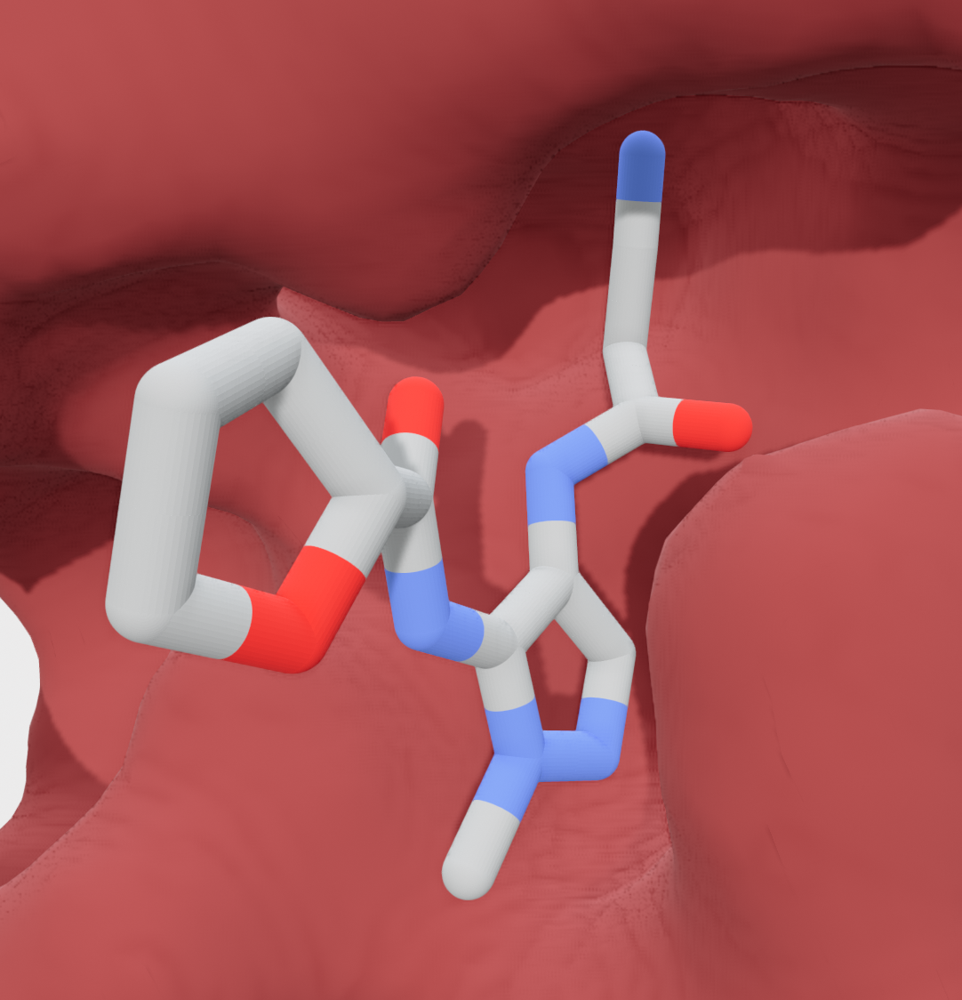
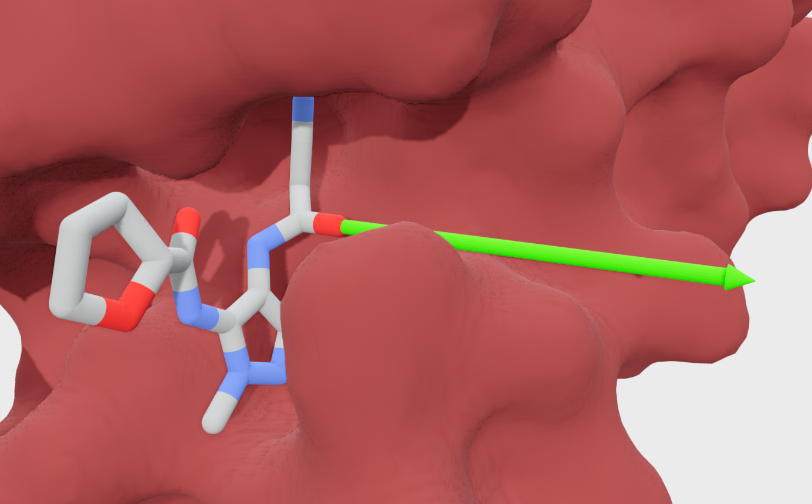
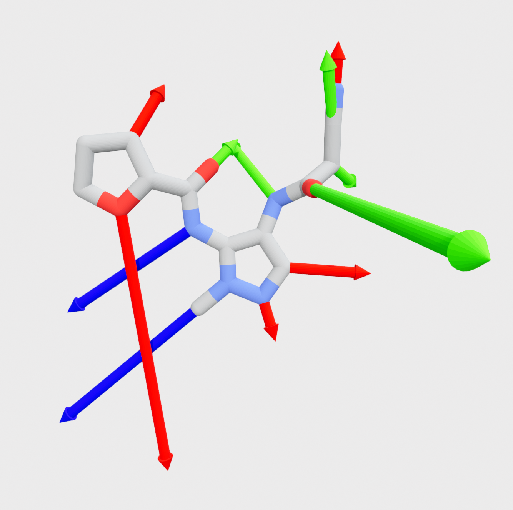

===========================
Exploring expansion vectors
===========================

Getting some test data
======================

The test data used in this example is available at test_data_.

Loading a PoseButcher object
----------------------------

::

	from posebutcher import PoseButcher
	butcher = PoseButcher.from_directory('test_data/butcher_2a_x0310_noP5P6')

Loading an example ligand
-------------------------

::

	mol_df = PandasTools.LoadSDF('test_data/2a_bases.sdf')
	mol = mol_df.iloc[1]['ROMol']
	mol._Name = mol_df.iloc[1]['ID']

Exploring expansion vectors
===========================

You can use `chop` to inspect the protein pockets that the ligand's atoms are in:

::

	butcher.chop(mol, draw='2d', indices=True)

Replace '2d' with '3d' to open a 3D viewer of the protein, ligand, and pockets:

Exploring a single expansion vector
-----------------------------------

From the 3d `chop` output we might be interested in expanding from atom index 7 (oxygen in the P1 pocket, but pointing to P1'):

::

	butcher.explore(mol, origin=7)

Pass `draw = False` to prevent the 3d output. The `explore` function will return:

::

	{
		'origin': ('GOOD', 'pocket', 'P1'),
		'direction': array([-0.64592783, -0.37550155, -0.66466218]),
		'intersections': 
			{
				1.109: ('GOOD', 'pocket', "P1'"),
				2.892: ('GOOD', 'pocket', "P2'"),
				10.641: ('BAD', 'solvent space')
			},
		'first_intersection_distance': 1.109,
		'new_pocket': True,
		'last_intersection_distance': 10.641,
		'destination': 'solvent space',
		'max_atoms_added': inf,
		'success': True
	}

N.B. for large `last_intersection_distance` values (> 5.5) the `max_atoms_added` will always be infinity.

Exploring all expansion vectors
-------------------------------

To explore all the expansion vectors don't pass an `origin` parameter to `explore`:

::

	butcher.explore(mol)

The output will be a list of all the output dictionaries for the vectors.

::

	[{'atom_index': 0,
	  'origin': ('GOOD', 'pocket', 'P1'),
	  'direction': array([ 0.74649838, -0.49720134, -0.44218887]),
	  'intersections': {6.981: ('BAD', 'solvent space')},
	  'first_intersection_distance': 6.981,
	  'new_pocket': False,
	  'last_intersection_distance': 6.981,
	  'destination': 'solvent space',
	  'max_atoms_added': inf,
	  'success': True},
	 {'atom_index': 1},
	 {'atom_index': 2,
	  'origin': ('GOOD', 'pocket', 'P1'),
	  'direction': array([-0.04909108, -0.98667011,  0.15515206]),
	  'intersections': {1.699: ('BAD', 'protein clash')},
	  'first_intersection_distance': 1.699,
	  'new_pocket': False,
	  'last_intersection_distance': 1.699,
	  'destination': 'protein clash',
	  'max_atoms_added': 1,
	  'success': True},
	 {'atom_index': 3,
	  'origin': ('GOOD', 'pocket', 'P1'),
	  'direction': array([-0.7453661 , -0.22133142,  0.62884162]),
	  'intersections': {3.189: ('BAD', 'protein clash')},
	  'first_intersection_distance': 3.189,
	  'new_pocket': False,
	  'last_intersection_distance': 3.189,
	  'destination': 'protein clash',
	  'max_atoms_added': 7,
	  'success': True},
	 {'atom_index': 4},
	 {'atom_index': 5,
	  'origin': ('GOOD', 'pocket', 'P1'),
	  'direction': array([0.59644749, 0.77065031, 0.22438469]),
	  'intersections': {1.638: ('GOOD', 'pocket', 'P2'),
	   4.617: ('BAD', 'protein clash')},
	  'first_intersection_distance': 1.638,
	  'new_pocket': True,
	  'last_intersection_distance': 4.617,
	  'destination': 'protein clash',
	  'max_atoms_added': 7,
	  'success': True},
	 {'atom_index': 6},
	 {'atom_index': 7,
	  'origin': ('GOOD', 'pocket', 'P1'),
	  'direction': array([-0.64592783, -0.37550155, -0.66466218]),
	  'intersections': {1.109: ('GOOD', 'pocket', "P1'"),
	   2.892: ('GOOD', 'pocket', "P2'"),
	   10.641: ('BAD', 'solvent space')},
	  'first_intersection_distance': 1.109,
	  'new_pocket': True,
	  'last_intersection_distance': 10.641,
	  'destination': 'solvent space',
	  'max_atoms_added': inf,
	  'success': True},
	 {'atom_index': 8,
	  'origin': ('GOOD', 'pocket', 'P1'),
	  'direction': array([ 0.08383587, -0.26528064,  0.96051951]),
	  'intersections': {1.097: ('GOOD', 'pocket', 'P2'),
	   2.012: ('BAD', 'protein clash')},
	  'first_intersection_distance': 1.097,
	  'new_pocket': True,
	  'last_intersection_distance': 2.012,
	  'destination': 'protein clash',
	  'max_atoms_added': 1,
	  'success': True},
	 {'atom_index': 9,
	  'origin': ('GOOD', 'pocket', 'P2'),
	  'direction': array([-0.39798576,  0.74051448, -0.5415216 ]),
	  'intersections': {0.826: ('GOOD', 'pocket', "P1'"),
	   2.573: ('BAD', 'protein clash')},
	  'first_intersection_distance': 0.826,
	  'new_pocket': True,
	  'last_intersection_distance': 2.573,
	  'destination': 'protein clash',
	  'max_atoms_added': 3,
	  'success': True},
	 {'atom_index': 10,
	  'origin': ('GOOD', 'pocket', 'P2'),
	  'direction': array([-0.40351555,  0.88652452, -0.22638346]),
	  'intersections': {1.62: ('BAD', 'protein clash')},
	  'first_intersection_distance': 1.62,
	  'new_pocket': False,
	  'last_intersection_distance': 1.62,
	  'destination': 'protein clash',
	  'max_atoms_added': 1,
	  'success': True},
	 {'atom_index': 11},
	 {'atom_index': 12,
	  'origin': ('GOOD', 'pocket', 'P1'),
	  'direction': array([ 0.77108331, -0.40431042, -0.49189797]),
	  'intersections': {5.682: ('BAD', 'solvent space')},
	  'first_intersection_distance': 5.682,
	  'new_pocket': False,
	  'last_intersection_distance': 5.682,
	  'destination': 'solvent space',
	  'max_atoms_added': inf,
	  'success': True},
	 {'atom_index': 13},
	 {'atom_index': 14,
	  'origin': ('GOOD', 'pocket', 'P1'),
	  'direction': array([-0.45382675,  0.64855671,  0.61107731]),
	  'intersections': {0.87: ('GOOD', 'pocket', 'P2'),
	   1.543: ('BAD', 'protein clash')},
	  'first_intersection_distance': 0.87,
	  'new_pocket': True,
	  'last_intersection_distance': 1.543,
	  'destination': 'protein clash',
	  'max_atoms_added': 1,
	  'success': True},
	 {'atom_index': 15},
	 {'atom_index': 16,
	  'origin': ('BAD', 'solvent space'),
	  'direction': array([-0.22890259,  0.83199296,  0.50536256]),
	  'intersections': {2.628: ('BAD', 'protein clash')},
	  'first_intersection_distance': 2.628,
	  'new_pocket': False,
	  'last_intersection_distance': 2.628,
	  'destination': 'protein clash',
	  'max_atoms_added': 3,
	  'success': True},
	 {'atom_index': 17},
	 {'atom_index': 18},
	 {'atom_index': 19,
	  'origin': ('BAD', 'solvent space'),
	  'direction': array([ 0.21557068, -0.9479204 ,  0.23447003]),
	  'intersections': {10.017: ('BAD', 'protein clash')},
	  'first_intersection_distance': 10.017,
	  'new_pocket': False,
	  'last_intersection_distance': 10.017,
	  'destination': 'protein clash',
	  'max_atoms_added': inf,
	  'success': True}]

.. _test_data: https://github.com/mwinokan/PoseButcher/blob/main/test_data
